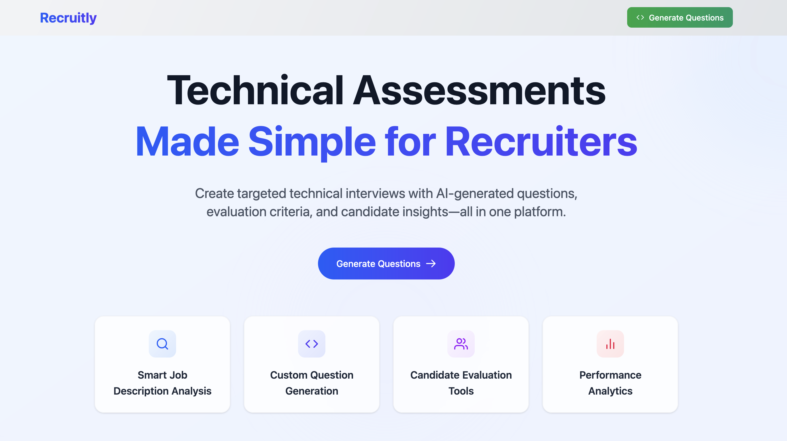
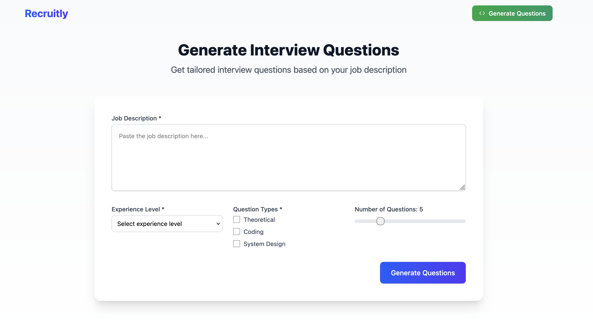
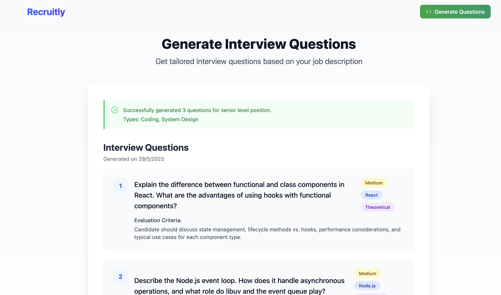
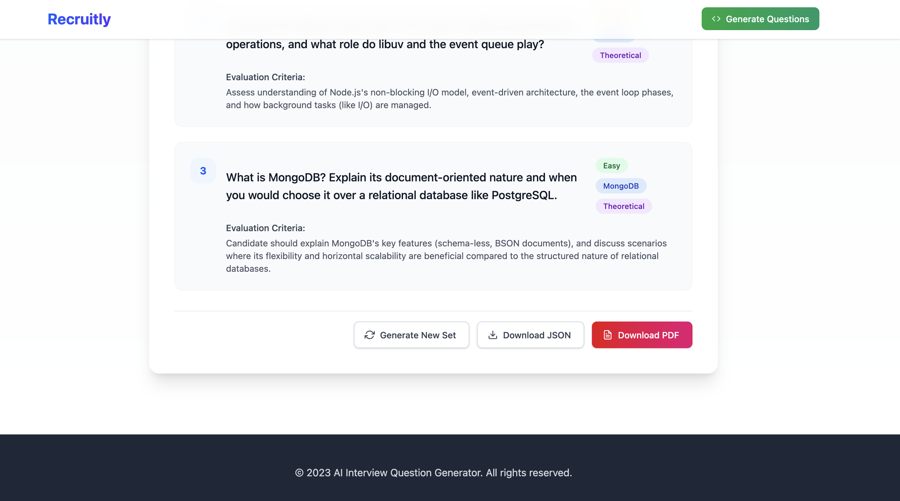

# Interview Question Generator

This application is a web-based interview question generator that creates tailored interview questions based on a provided job description and desired experience level.

## Features

- Generate interview questions from a job description.
- Specify the experience level for generated questions.
- Select different types of questions (theoretical, coding, system design).
- Download generated questions in JSON or PDF format.

## Screenshots

### Home Page



### Question Generation Form



### Generated Questions



### Options on Generated Questions



## Technologies Used

- **Client:** React, TypeScript, Tailwind CSS, react-icons, jspdf, html2canvas-pro
- **Server:** Node.js, Express.js, TypeScript (Based on file structure seen)

## Setup and Installation

1.  Clone the repository:

    ```bash
    git clone <repository_url>
    cd Asif-Interview-Questions-Generator
    ```

2.  **Install dependencies for the server and set up environment variables:**

    ```bash
    cd server
    npm install # or yarn install
    cp .env.sample .env
    # Open .env and add your OpenAI API key: OPENAI_API_KEY=your_api_key
    cd ..
    ```

3.  **Run Redis using Docker:**

    Make sure you have Docker installed and running. Then, run the following command from the project root:

    ```bash
    docker run --name redis-interview -d -p 6379:6379 redis
    ```

4.  Install dependencies for the client:

    ```bash
    cd client
    npm install # or yarn install
    cd ..
    ```

## Running the Application

1.  Start the server (adjust the command based on your server setup, e.g., using `nodemon` or `ts-node`):

    ```bash
    cd server
    npm start # or yarn start
    cd ..
    ```

2.  Start the client development server:

    ```bash
    cd client
    npm start # or yarn start
    cd ..
    ```

3.  Open your browser and navigate to the client application (usually `http://localhost:3000`).

## Contributing

If you'd like to contribute, please fork the repository and create a pull request.
